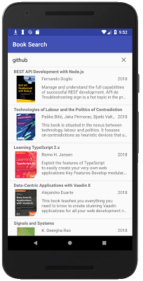

## Book Search App  

### Features  

This app is made for the final project assignment of the Udacity Android Basics: Networking course.  

The app uses the Google Books API to query the Books database by keywords and return the results.  

The user can search by keywords with the help of the top searchbar. After the search has been initiated, a progress bar informs the user that 
the search is in progress.   

   

The app loads the list of search results, along with the titles, authors, images, and dates of publishing of the books. The API querying, and the image 
loading are all done asynchronously. If there is no image, a "default" image is shown. If the user clicks a list item, the app sends an intent 
to open the Google Books website, containing more details on the book.  

     

If there are no results, the app warns the user. Since the query is done through the internet, if there is no internet, the user is warned.  

   

### Technical notes  

From the technical point of view, the app uses an ArrayAdapter to load the information from the individual Book objects into the ListView. An 
AsyncTaskLoader takes care of getting the book data from the Google Books API. There is another AsyncTask that loads the images. The QueryUtils.java
contains functions to make the http request, retrieve the JSON results, extract the features from the JSON object, and store it in a Book Array.  
